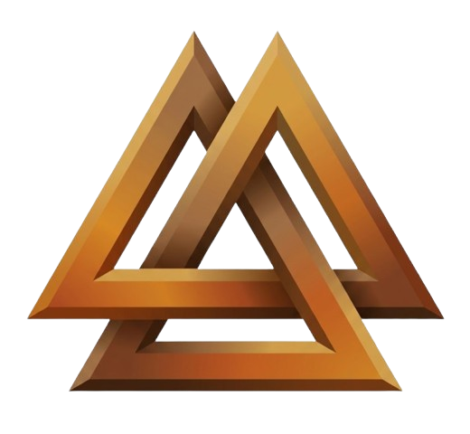

<!-- Don't delete it -->
<div name="readme-top"></div>

<p align="center">
  
  &nbsp;&nbsp;&nbsp;&nbsp;
  
</p>

<div align="center">

# Tectonic EVM Web UI

[](https://github.com/StabilityNexus/Tectonic-EVM-WebUI)

</div>

<p align="center">
<a href="https://t.me/StabilityNexus">
</a>
&nbsp;&nbsp;
<a href="https://x.com/StabilityNexus">
</a>
&nbsp;&nbsp;
<a href="https://discord.gg/YzDKeEfWtS">
</a>
&nbsp;&nbsp;
<a href="https://news.stability.nexus/">
</a>
&nbsp;&nbsp;
<a href="https://linkedin.com/company/stability-nexus">
</a>
&nbsp;&nbsp;
<a href="https://www.youtube.com/@StabilityNexus">
</a>
</p>

---

A modern web interface for the Tectonic Protocol, enabling users to explore deployments, equity coins, stablecoin mechanics, force redemption operations, and ecosystem information through an intuitive Next.js application.

## Table of Contents

- [Overview](#overview)
- [Features](#features)
- [Tech Stack](#tech-stack)
- [Project Structure](#project-structure)
- [Getting Started](#getting-started)
- [Local Development](#local-development)
- [Build & Deployment](#build--deployment)
- [Environment Variables](#environment-variables)
- [Roadmap](#roadmap)
- [Community and Support](#community-and-support)
- [Contributing](#contributing)

## Overview

Tectonic is an EVM-compatible stablecoin infrastructure platform inspired by the principles of the Djed Stablecoin Protocol.

The web interface serves as the primary gateway for users to:

- Explore protocol deployments
- Learn about StablePay
- Monitor Equity Coins
- Understand Force Redemption mechanisms
- Access ecosystem resources
- Connect with the Stability Nexus community

The application is built with Next.js and TypeScript, providing a fast, responsive, and accessible user experience.

## Features

- Modern responsive landing page
- Deployment explorer
- Equity Coin information dashboard
- StablePay ecosystem section
- Force Redemption information hub
- Community integration
- Mobile-friendly UI
- Fast static deployment support
- SEO-ready metadata structure

## Tech Stack

- Next.js 16
- React 19
- TypeScript
- Tailwind CSS 4
- ESLint

## Project Structure

```text
Tectonic-EVM-WebUI/
├── app/
│   ├── page.tsx
│   ├── layout.tsx
│   └── globals.css
├── public/
│   ├── stability.svg
│   ├── Logo.svg
│   └── tectonic-hero.png
├── components/
├── package.json
├── next.config.ts
├── tsconfig.json
└── README.md
```

## Getting Started

```bash
git clone https://github.com/StabilityNexus/Tectonic-EVM-WebUI.git
cd Tectonic-EVM-WebUI
npm install
```

## Local Development

```bash
npm run dev
```

Open:

```text
http://localhost:3000
```

## Build & Deployment

### Production Build

```bash
npm run build
```

### Start Production Server

```bash
npm run start
```

### Export Static Site

```bash
npm run build
```

### GitHub Pages Deployment

This repository uses GitHub Pages via `.github/workflows/nextjs.yml`. Push to `main` to trigger the deployment workflow.

## Environment Variables

```env
NEXT_PUBLIC_APP_NAME=Tectonic
NEXT_PUBLIC_NETWORK=EVM
```

Add any future protocol-specific variables here.

## Roadmap

- [x] Landing page
- [x] Community integration
- [x] StablePay section
- [x] Deployment dashboard
- [x] Equity Coin overview
- [x] Force Redemption page
- [ ] Protocol analytics
- [ ] Governance dashboard
- [ ] Public deployment URL
- [ ] Multi-chain explorer

## Community and Support

Join the Stability Nexus ecosystem:

- Telegram
- Discord
- X (Twitter)
- Stable Viewpoints
- LinkedIn
- YouTube

Use the badge links at the top of this README to connect with the community channels.

## Contributing

We welcome community contributions.

1. Fork the repository.
2. Create a feature branch.
3. Implement your changes.
4. Run:

```bash
npm run build
npm run lint
```

5. Submit a Pull Request.

<p align="center">
  <strong>Built with ❤️ by Stability Nexus.</strong>
</p>

<p align="right">
  (<a href="#readme-top">back to top</a>)
</p>
