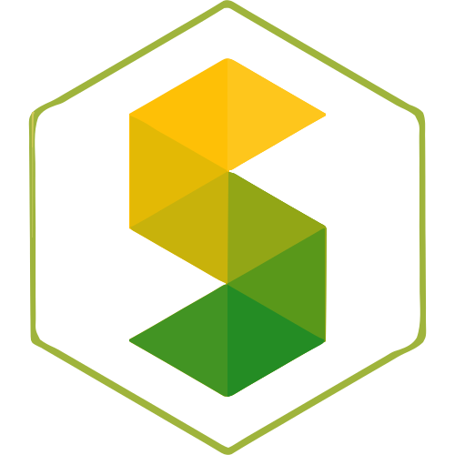

<!-- Don't delete it -->
<div name="readme-top"></div>

<!-- Organization Logo -->
<div align="center" style="display: flex; align-items: center; justify-content: center; gap: 16px;">
   
   
</div>

&nbsp;

<!-- Organization Name -->
<div align="center">

[](https://github.com/StabilityNexus/Tectonic-EVM-WebUI)

</div>

<!-- Organization/Project Social Handles -->
<p align="center">
<!-- Telegram -->
<a href="https://t.me/StabilityNexus">
</a>
&nbsp;&nbsp;
<!-- X (formerly Twitter) -->
<a href="https://x.com/StabilityNexus">
</a>
&nbsp;&nbsp;
<!-- Discord -->
<a href="https://discord.gg/YzDKeEfWtS">
</a>
&nbsp;&nbsp;
<!-- Medium -->
<a href="https://news.stability.nexus/">
   </a>
&nbsp;&nbsp;
<!-- LinkedIn -->
<a href="https://linkedin.com/company/stability-nexus">
   </a>
&nbsp;&nbsp;
<!-- Youtube -->
<a href="https://www.youtube.com/@StabilityNexus">
   </a>
</p>

---

<div align="center">
<h1>Tectonic EVM Web UI</h1>
</div>

[Tectonic](https://github.com/StabilityNexus/Tectonic-EVM-WebUI) is a Next.js frontend for the Tectonic protocol. It presents the protocol story, feature highlights, community links, and update sections in a polished landing page experience.

---

## Project Maturity

* [x] The project has a logo.
* [x] The project has a hero image.
* [x] The web frontend has proper title and metadata scaffolding.
* [x] The web frontend is built with Next.js and TypeScript.
* [x] The web frontend uses Tailwind CSS for styling.
* [x] The web frontend is fully static and client-side.
* [ ] The project has a dedicated favicon.
* [ ] The project has a deployed public URL.
* [ ] The project has final open graph metadata.

---

## Tech Stack

### Frontend

- Next.js 16
- React 19
- TypeScript
- Tailwind CSS 4
- ESLint

### Assets

- Stability Nexus brand logo
- Tectonic hero illustration

---

## Project Structure

### App Router

- `app/page.tsx` - main landing page content
- `app/layout.tsx` - root layout and metadata
- `app/globals.css` - global styles and animations

### Public Assets

- `public/stability.svg` - brand logo used in the README and UI
- `public/tectonic-hero.png` - hero illustration used on the homepage

### Project Config

- `package.json` - scripts and dependencies
- `next.config.ts` - Next.js configuration
- `tsconfig.json` - TypeScript configuration

---

## Getting Started

### Prerequisites

- Node.js 20+
- npm

### Installation

#### 1. Clone the Repository

```bash
git clone https://github.com/StabilityNexus/Tectonic-EVM-WebUI.git
cd Tectonic-EVM-WebUI
```

#### 2. Install Dependencies

```bash
npm install
```

#### 3. Run the Development Server

```bash
npm run dev
```

#### 4. Open your Browser

Navigate to [http://localhost:3000](http://localhost:3000) to see the application.

#### 5. Build for Production

```bash
npm run build
```

#### 6. Start the Production Server

```bash
npm run start
```

---

## Contributing

We welcome contributions of all kinds. To contribute:

1. Fork the repository and create your feature branch (`git checkout -b feature/AmazingFeature`).
2. Commit your changes (`git commit -m 'Add some AmazingFeature'`).
3. Run the development workflow commands to ensure code quality:
    - `npm run build`
    - `npm run lint`
4. Push your branch (`git push origin feature/AmazingFeature`).
5. Open a Pull Request for review.

If you encounter bugs, need help, or have feature requests, open an issue with the relevant details and screenshots if possible.

We appreciate your feedback and contributions!

© 2026 The Stable Order.
